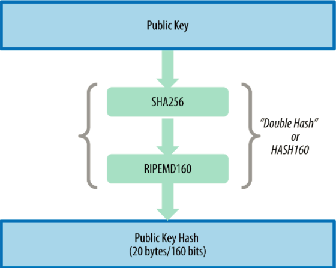
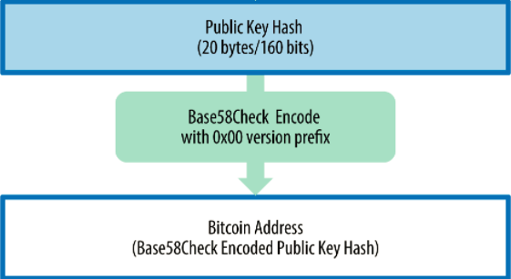

# 比特币中的密码学知识汇总

目前，我的`阅读比特币源码`系列文章已经更新了5篇，对应于[精通比特币](https://github.com/bitcoinbook/bitcoinbook)前3章内容的学习。

现在来到第4章[密钥与地址](https://github.com/bitcoinbook/bitcoinbook/blob/develop/ch04.asciidoc)的学习，本章主要介绍了比特币系统中公钥，私钥和地址之间相互的关系，如何生成比特币地址，以及对于比特币地址和密钥的一些高级用法。

在这一章的学习中，对于刚入门的人来说，会被突然冒出的茫茫多密码学相关知识搞得举步维艰，因此对于密码学相关知识有一定了解是必要的。

在经过一段时间的积累后，我将比特币中涉及的密码学知识相应的优质教程进行汇总如下。（本文不涉及知识的详细讲解，仅提供一个梳理后的资料大纲，大家按需学习）

**比特币中涉及的密码学知识有：**

- SHA-256
- RIPEMD-160
- Base58 Encode
- Base58Check Encode
- Elliptic Curve

下面分别给出更详细汇总结果。

## 1. 数字指纹

数字指纹，又称哈希函数，散列算法，是一种从任何一种数据中创建固定大小的数字“指纹”的方法。散列函数把消息或数据压缩成摘要，使得数据量变小，将数据的格式固定下来。该函数将数据打乱混合，重新创建一个叫做散列值（或哈希值）的指纹。散列值通常用一个短的随机字母和数字组成的字符串来代表。

 SHA 和 RIPEMD 是两类重要的哈希函数集合，具体地，SHA-256 和 RIPEMD-160 在比特币系统中`使用公钥生成公钥哈希`的过程中被应用。

下面来看看具体的教程推荐。

### 1.1 SHA-256

作为一个简单了解，推荐这个教程。直观体验SHA-256是什么？为什么进行SHA-256？如何验证SHA-256结果？

[操作指南：验证SHA256](https://nxtwiki.org/mediawiki/index.php?title=How-To:VerifySHA256/zh&variant=zh)

进一步可以参看SHA-2系安全散列算法的wiki百科页面，比较综合，有解释有代码

[wiki：SHA-2](https://zh.wikipedia.org/wiki/SHA-2)

如果想深究原理，建议看我写的这篇博文，费了不少功夫，个人感觉解释的很详细。

[SHA256算法原理详解](https://blog.csdn.net/u011583927/article/details/80905740)

[SHA256 的C语言实现](https://blog.csdn.net/u011583927/article/details/80953491)

### 1.2 RIPEMD-160

想简单了解RIPEMD-160，探索 RIPEMD-160 是什么？ 有多快？ 以及一些更深入学习的链接。推荐下面两个链接

[wiki : RIPEMD](https://zh.wikipedia.org/wiki/RIPEMD)

[The hash function RIPEMD-160](https://homes.esat.kuleuven.be/~bosselae/ripemd160.html)

进一步可以参看RIPEMD-160的bitcoinwiki页面，具体过程更详细一些，有伪代码提供

[bitcoinwiki : RIPEMD-160](https://en.bitcoin.it/wiki/RIPEMD-160)

对细节要求严苛的话，直接看论文吧：

[The Cryptographic Hash Function RIPEMD-160](https://www.esat.kuleuven.be/cosic/publications/article-317.pdf)

## 2. 非对称加密

在比特币系统中，我们使用公开密钥加密（非对称加密）创建一个密钥对来控制比特币的获取。这个密钥对包含了一个私钥和一个（由私钥导出的唯一）公钥。公钥被用来接收款项，私钥被用来签署一笔交易来花费比特币。

公钥和私钥的背后存在着数学联系，来保证私钥可以被用来在消息上进行签名，并且这个签名可以被任何人使用对应的公钥验证（在不接触私钥的情况下）。

在比特币系统中，你需要学习的非对称加密相关知识有：

首先，了解非对称加密的基本概念[非对称加密概述](https://blog.csdn.net/u011583927/article/details/81272265)

随后，比特币的公钥是由私钥通过椭圆曲线乘法导出的，那么`什么是椭圆曲线？`

如果你很难理解椭圆曲线，不妨先学一个更简单的非对称加密算法作为过渡：`RSA加密算法`

此外，在交易中，需要使用私钥进行签名，那么`什么是数字签名？`

最后，作为链圈币圈的人，如果感兴趣不妨了解下`什么是数字证书？`

具体资料如下：

### 2.1 椭圆曲线算法

掌握椭圆曲线需要对于模运算有所了解，这个网站提供了一些非常简单的教程，还有测试和小游戏用来巩固概念，挺有意思的。

[模运算](https://www.khanacademy.org/computing/computer-science/cryptography/modarithmetic/a/what-is-modular-arithmetic)

椭圆曲线算法的数学性应该算是区块链相关知识中比较强的，很多教程号称用一种简单直白的方式在不涉及数学的情况下让你明白什么是椭圆曲线，相信我那不靠谱。

学习椭圆曲线算法最好的方式就是找经典英文教材，耐下心来读。推荐这个系列教程共4篇：

[1. a gentle introduction](http://andrea.corbellini.name/2015/05/17/elliptic-curve-cryptography-a-gentle-introduction/)

[2. finite fields and discrete logarithms](http://andrea.corbellini.name/2015/05/23/elliptic-curve-cryptography-finite-fields-and-discrete-logarithms/)

[3. ECDH and ECDSA](http://andrea.corbellini.name/2015/05/30/elliptic-curve-cryptography-ecdh-and-ecdsa/)

[4. breaking security and a comparison with RSA](http://andrea.corbellini.name/2015/06/08/elliptic-curve-cryptography-breaking-security-and-a-comparison-with-rsa/)

读完这些，你再回过头来看一些中文资料，既能看懂，又能加深理解。

[椭圆曲线加密算法介绍](https://juejin.im/post/5a67f3836fb9a01c9b661bd3)

[椭圆曲线算法的几个不同角度的解释（知乎）](https://www.zhihu.com/question/22399196)

### 2.2 RSA算法

如果你很难理解椭圆曲线，不妨先学一个更简单的非对称加密算法：`RSA加密算法`

RSA加密算法的简单介绍：

[wiki：RSA algorithm](https://simple.wikipedia.org/wiki/RSA_algorithm)

[RSA Encryption – Tutorial](http://khaledkalam.com/admin/book/21dcdc9783.pdf)

RSA加密算法流程的详细教程：

[阮一峰的网络日志：RSA算法原理（一）](http://www.ruanyifeng.com/blog/2013/06/rsa_algorithm_part_one.html)

[阮一峰的网络日志：RSA算法原理（二）](http://www.ruanyifeng.com/blog/2013/07/rsa_algorithm_part_two.html)

[How RSA Works With Examples](http://doctrina.org/How-RSA-Works-With-Examples.html)

### 2.3 数字签名

比特币系统中，一笔交易归属以及真伪的验证使用了数字签名技术。

数字签名指的是对一段信息制作签名表示对其的认可，这个认可只对该信息有效，并且第三方无法根据该签名构造你对其他信息的签名。数字签名方案包括：

生成公钥私钥对，私钥用于签名，必须安全保存；公钥可以公开，用于他人验证签名有效性

把信息和私钥作为输入，输出即为签名

使用公钥，信息和签名作为输入，进行验证

在实践中，我们往往通过对哈希值进行签名，这样可以实现对任意长度信息的签名。

详细过程可以阅读[What is a Digital Signature?](http://www.youdzone.com/signature.html)

以及[非对称加密概述](https://blog.csdn.net/u011583927/article/details/81272265)中的数字签名部分

### 2.4 数字证书

数字证书是非对称加密的又一个重要应用，据我所知在比特币系统中并没有直接应用。但也确实是个重要的概念，作为链圈币圈的人，如果感兴趣不妨了解下什么是数字证书？

推荐看这篇文章[数字证书原理](http://www.blogjava.net/freeman1984/archive/2012/07/24/383817.html),讲的很清晰

## 3. Base58编码

Base58编码在比特币的密钥和地址的编码中被广泛使用,用来增强密钥或地址的可读性以及防止传输或转录过程中发生错误。

例如，比特币地址是在公钥哈希的基础上，使用Base58Check编码得到的。

### 3.1 Base58 Encode

Base58是用于Bitcoin中使用的一种独特的编码方式，主要用于产生Bitcoin的钱包地址。

Base58是在base64编码的基础上得到的，去掉了容易混淆的字母（不使用数字"0"，字母大写"O"，字母大写"I"，和字母小写"l"），以及影响双击选择字符串的字母（"+"和"/"符号）。

我们首先要需要了解什么是Base64编码

[wiki : base64](https://zh.wikipedia.org/wiki/Base64)

[Base64笔记(阮一峰的网络日志)](http://www.ruanyifeng.com/blog/2008/06/base64.html)

然后再来学习base58编码

[wiki : base58](https://zh.wikipedia.org/wiki/Base58)

[learn me a bitcoin : Base58](http://learnmeabitcoin.com/glossary/base58)

### 3.2 Base58Check Encode

而 Base58Check 编码其实就是在Base58编码的基础上，添加了校验的过程。流程并不复杂，如下图所示：

其实上图已经将 Base58Check 编码的过程描述清楚了，更多的细节请参考：

[bitcoinwiki : Base58Check encoding](https://en.bitcoin.it/wiki/Base58Check_encoding)
